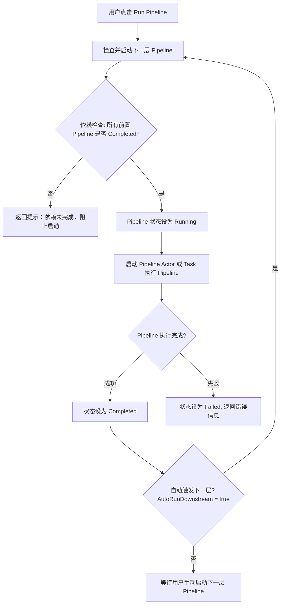

```pgsql               
               +----------------------+
               |    PipelineActor     |
               |  (Orchestrator)      |
               +-----------+----------+
                           |
                           |
          +----------------+----------------+
          |                                 |
    +-----v------+                    +------v------+
    | ExtractActor|   Raw Batch       |TransformActor|
    |   (Source)  +------------------>+ (Transformer)|
    +------+------/                   +------+-------+
           |                                 |
           | Transformed Batch               |
           v                                 v
      +----+-----------+        Checkpoint + Batch
      |   LoadActor    +----------------------------+
      |     (Sink)     |                            |
      +----------------+                            |
               |                                     |
               +-----------> PipelineActor <----------+
                         checkpoint update
```


AkkaSync/ ├─ src/ │ ├─ AkkaSync.Core/ │ │ ├─ Actors/ │ │ │ ├─ PipelineActor.cs │ │ │ ├─ ExtractActor.cs │ │ │ ├─ TransformActor.cs │ │ │ ├─ LoadActor.cs │ │ │ └─ SupervisorStrategy.cs │ │ ├─ Pipeline/ │ │ │ ├─ SyncPipeline.cs │ │ │ ├─ CheckpointStore.cs │ │ │ └─ ISyncSource.cs / ISyncSink.cs / ITransformer.cs │ │ ├─ Messaging/ │ │ ├─ Configuration/ │ │ └─ Utilities/ │ │ │ ├─ AkkaSync.Plugins/ │ │ ├─ FileSource/ │ │ ├─ SqlServerSource/ │ │ ├─ ApiSource/ │ │ ├─ SqliteSink/ │ │ ├─ KafkaSink/ │ │ └─ CustomTransformer/ │ │ │ ├─ AkkaSync.Demo/ │ │ ├─ Examples/ │ │ │ └─ FileToSqlite/ │ │ └─ DemoConsole/ │ │ │ └─ AkkaSync.Management/ │ ├─ CLI/ │ └─ WebDashboard (未来可加) ├─ tests/ │ ├─ AkkaSync.Core.Tests/ │ └─ AkkaSync.Plugins.Tests/ ├─ docs/ │ ├─ Architecture.md │ ├─ GettingStarted.md │ └─ PipelineExamples.md └─ README.md


