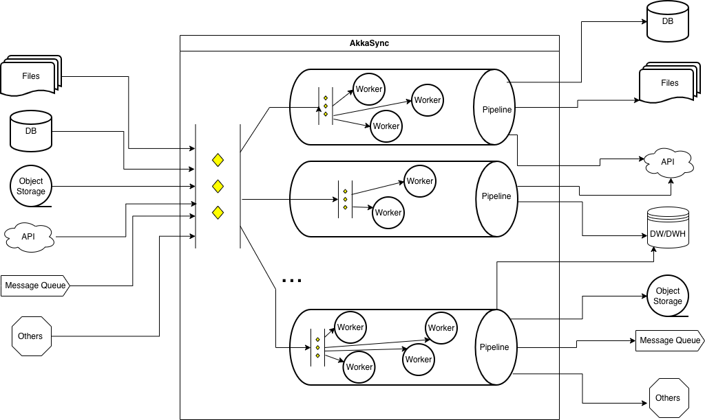
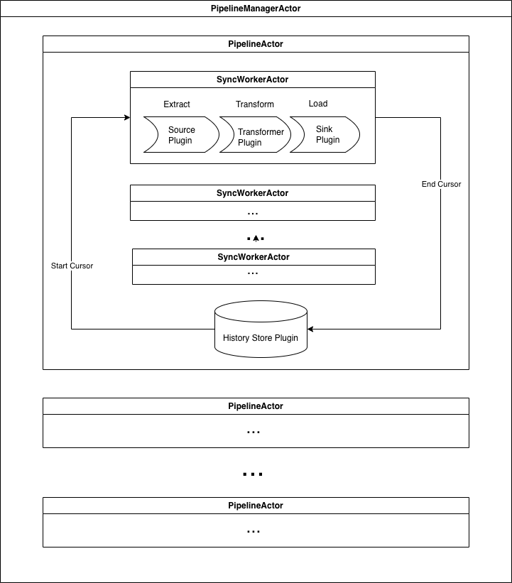

# AkkaSync

**AkkaSync** is a lightweight, extensible data-synchronization framework built on the **Akka.NET actor model**.
It offers a configuration-driven **Extract → Transform → Load (ETL)**  pipeline featuring **high concurrency**, **failure isolation**, and **scalable parallel processing**.

AkkaSync was initially designed to support **reliable**, **concurrent**, and **parallel** data transformation and synchronization across heterogeneous storage mediums—such as files, databases, and message queues—commonly found in distributed application environments.

The framework adopts a **plugin-oriented architecture**, defining four extensible module types:

- **Source**  – Responsible for extracting data from external systems or storage mediums.
- **Transformer**  – Applies business logic to convert, filter, or reshape the extracted data.
- **Sink**  – Persists the processed data into the target system or storage layer.
- **HistoryStore** – Maintains synchronization metadata to support incremental and reliable processing.

This modular design allows the system to evolve organically, making it easier to introduce new capabilities and adapt to broader integration scenarios over time.
The project structure is intentionally kept flexible: the core runtime and plugin modules are isolated from each other, and each plugin can be developed, versioned, and published independently. This allows users to depend only on the components they need while keeping integrations clean and maintainable.

## 🧩 Architecture Overview

### Concurrent and Parallel Pipelines in AkkaSync

### Actors & Plugins in AkkaSync

## 📘 Architecture Components

### **1. PipelineManagerActor**
Manages global orchestration:

- Loads pipeline definitions from configuration  
- Builds and validates dependency DAG  
- Starts pipeline execution  
- Supervises PipelineActor lifecycle  

➡️ *See: [PipelineManagerActor](./docs/pipeline-manager.md)*

### **2. PipelineActor**
Owns execution of a single pipeline:

- Starts sync steps in correct order  
- Spawns and supervises SyncWorkerActor  
- Handles backoff, retries, and failures  
- Reports progress to the manager  

➡️ *See: [PipelineActor](./docs/pipeline.md)*

### **3. SyncWorkerActor**
Handles actual business execution:

- Invokes data source and sink plugins  
- Performs sync logic  
- Reports cursor & progress  
- Isolated, restartable, testable  

➡️ *See: [SyncWorkerActor](./docs/worker.md)*

---

### **4. Plugins**
Plugins enable extensibility:

- **Source plugins**: CSV, SQL, API...  
- **Sink plugins**: Sqlite, SqlServer, ElasticSearch  
- **Transform plugins**: Clean, map, enrich  

Each plugin runs inside a worker, making the system highly modular.

➡️ *See: [Plugins](./docs/plugins.md)*