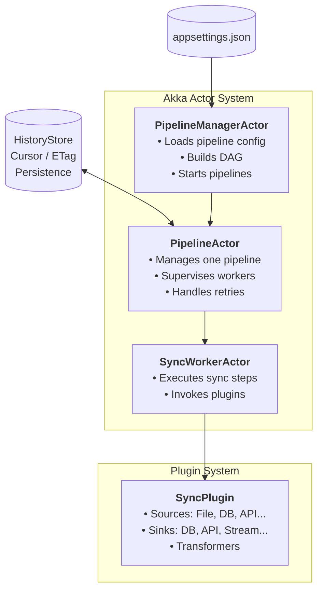

# AkkaSync

**AkkaSync** is a lightweight, extensible data-synchronization framework built on the **Akka.NET actor model**.  
It provides a configuration-driven **Extract → Transform → Load (ETL)** pipeline with **high concurrency**, **failure isolation**, and **resumable execution** via **cursor/ETag checkpointing**.

## Core Design Goals

- **Actor-based pipeline orchestration**  
- **Isolated, fault-tolerant worker execution**  
- **Plugin-driven Sources / Transformers / Sinks**  
- **Resume & retry with persistent HistoryStore**  
- **Simple to configure, easy to extend**  

## 🧩 Architecture Overview

## 📘 Architecture Components

### **1. PipelineManagerActor**
Manages global orchestration:

- Loads pipeline definitions from configuration  
- Builds and validates dependency DAG  
- Starts pipeline execution  
- Supervises PipelineActor lifecycle  

➡️ *See: [PipelineManagerActor](./docs/pipeline-manager.md)*

### **2. PipelineActor**
Owns execution of a single pipeline:

- Starts sync steps in correct order  
- Spawns and supervises SyncWorkerActor  
- Handles backoff, retries, and failures  
- Reports progress to the manager  

➡️ *See: [PipelineActor](./docs/pipeline.md)*

### **3. SyncWorkerActor**
Handles actual business execution:

- Invokes data source and sink plugins  
- Performs sync logic  
- Reports cursor & progress  
- Isolated, restartable, testable  

➡️ *See: [SyncWorkerActor](./docs/worker.md)*

---

### **4. Plugins (IPlugin)**
Plugins enable extensibility:

- **Source plugins**: CSV, SQL, API...  
- **Sink plugins**: Sqlite, In-Memory, Custom  
- **Transform plugins**: Clean, map, enrich  

Each plugin runs inside a worker, making the system highly modular.

➡️ *See: [Plugins](./docs/plugins.md)*

---

## 🚀 Key Features

- **Actor-based concurrency** using Akka.NET  
- **Plugin-driven extensibility**  
- **Dependency-aware pipeline execution with DAG**  
- **Lightweight, test-friendly design**  
- **Supports multiple data sources and sinks**  
- **Structured logging & observability**  
- **Easy to embed into any .NET application**