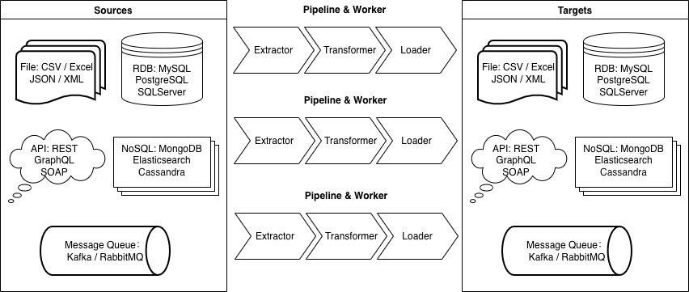
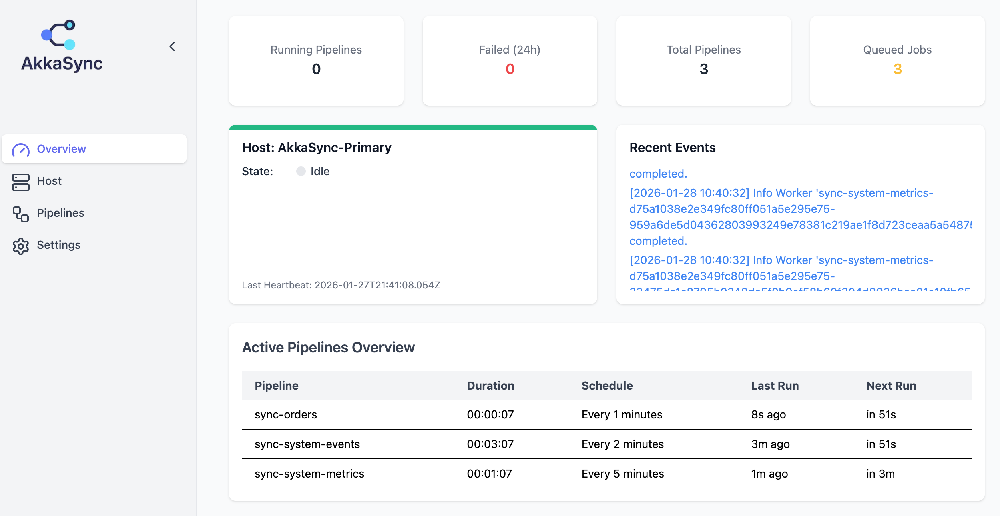

# AkkaSync

## Overview
**AkkaSync** is an extensible data synchronization framework built on Akka.NET, designed to read, transform, and write data between heterogeneous systems through a plugin-driven pipeline. The framework uses the actor model as its execution core, enabling reliable pipeline orchestration, concurrent processing, and state tracking.

AkkaSync aims to provide a lightweight yet structured foundation for ETL-style workflows, where components can evolve independently while remaining composable and predictable.



## Key Features
### Plugin-Oriented Architecture
AkkaSync is built around a modular plugin system that separates responsibilities into four provider contracts:

- `ISyncSource` — reads data from upstream systems

- `ISyncTransformer` — transforms or enriches data

- `ISyncSink` — writes data to downstream targets

- `IHistoryStore` — records execution state and history

Plugins are dynamically discovered and loaded via a file-based loader, allowing hot updates without requiring host application changes.

### Actor-Driven Execution Model

Each pipeline is coordinated by a dedicated PipelineActor, while worker actors perform the actual data processing. This design provides:

- Controlled concurrency

- Fault isolation and recovery

- Progress reporting

- Scalable execution patterns

The actor model ensures predictable behavior under load while keeping pipeline logic decoupled from execution mechanics.

### Convention-Based Plugin Loader

A PluginLoader scans the plugins directory and loads assemblies following the naming convention:

```
AkkaSync.Plugins.*.dll
```

This convention simplifies extension and deployment while maintaining a clear boundary between the host and plugins.

## MVP (Minimal Viable Product)
The AkkaSync MVP is designed to let interested users quickly validate the core runtime, plugin model, and end-to-end pipeline flow with minimal setup. It provides a compact, runnable environment that demonstrates how AkkaSync operates in practice.

### Purpose

- Provide a fast, hands-on way to evaluate AkkaSync

- Demonstrate the actor runtime, plugin loading, and pipeline execution

- Show a complete source → transform → sink workflow

### What It Contains

- **Core runtime** - actor-based scheduling(cron), pipeline orchestration, and worker execution

- **Plugin system** - dynamic provider loading via convention-based discovery

- **Runnable example pipelines** - CSV → SQLite flow with history persistence

- **Plugins folder convention** - drop AkkaSync.Plugins.*.dll into the runtime folder to load providers

- **Lightweight dashboard** - SignalR-based hub for observing pipeline status

- **Packaging layout** - simple structure suitable for local or container deployment

### How to Obtain

You can download the MVP from the project releases:

👉 GitHub Releases:
https://github.com/oninebx/AkkaSync/releases

> Usage: For detailed instructions on running the MVP, please refer to the README included in the GitHub release